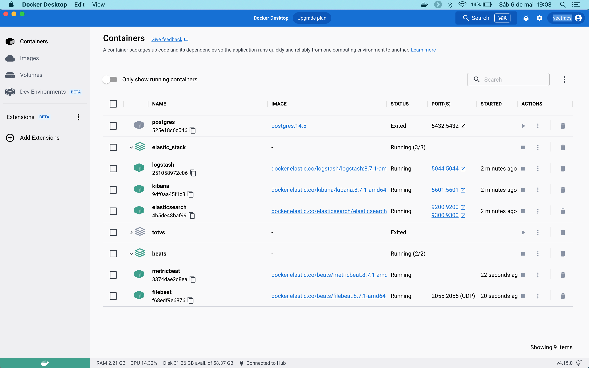

[](https://www.linkedin.com/in/houstonsantos/)

# Elastic Stack

Afinal, o que é o ELK Stack? "ELK" é o acrônimo para três projetos open source: Elasticsearch, Logstash e Kibana. O Elasticsearch é um mecanismo de busca e análise. O Logstash é um pipeline de processamento de dados do lado do servidor que faz a ingestão de dados a partir de inúmeras fontes simultaneamente, transforma-os e envia-os para um "esconderijo" como o Elasticsearch. O Kibana permite que os usuários visualizem dados com diagramas e gráficos no Elasticsearch.

<p align="center">
    
</p>

O Elastic Stack é a próxima evolução do ELK Stack. Quer saber mais da uma olhadinha neste [Link](https://www.elastic.co/pt/what-is/elk-stack)


## Elatic Stack com Docker

<div style="clear: right;">
    <p style="float: right;">
        
    </p>
    <p>
        O objetivo aqui é realizar a implementação da pilha do Elastic Stack utilizando Docker Compose. Iremos utilizar dos mais diversos recursos que a solução nos oferece em um projeto Self-Managed Standalone.
    </p>
</div>

**Recusos abordados**
  * Kibana
  * Elasticsearch (single node)
  * Logstash
  * Bets

>A ideia é aborda recursos nativos da solução da Elastic. Podendo assim servir como ponto de partida para outros projetos dos mais diversos.

## 1. Ambiente de projeto
Com o Docker e Compose já instalados clone o repositório, o mesmo deve ter a seguinte estrutura:
```
.
├── README.md
├── beats
│   ├── filebeat.yml
│   └── metricbeat.yml
├── docker-compose-beats.yml
├── docker-compose.yml
├── img
│   ├── docker.png
│   └── elastic.gif
└── logstash
    ├── config
    │   ├── logstash.yml
    │   └── pipelines.yml
    └── pipeline
        ├── logstash.conf
        └── netflow.conf
```

### Variáveis de ambiente
Configuração do arquivo .env:
>Neste arquivo você deve informa usuário e senha para o elastic. Note que tenho uma seção para o Kibana e Logstash, na medida que você for customisando seu projeto, para uma melhor organização você deve utilizá-las.
```
# ElasticSearch
ELASTIC_USER=elastic
ELASTIC_PASSWORD=elastic
CLUSTER_NAME=houston_santos

# Kibana
KIBANA_PASSWORD=elastic
MEM_LIMIT=1073741824
```

## 2. Estrutura do projeto
Note que você terá dois arquivos .yml o docker-compose.yml e o docker-compose-beats.yml. Por que disso?
O projeto foi divididdo dessa forma por varios motivos; primeiro que desta forma você terá duas pilhas de execução, uma do ELK e outra para os Beats, assim se você usa em seu ambiente de teste ou desenvolvimento e ate mesmo em produção, você pode executar a pilha dos Betas quando for realmente necessário, e em um ambiente de produção você poderar ter maior flexibilidade entre os serviços, principalmente em manutenções. Porem deixei tudo isso em um único projeto.

>No arquivo docker-compose.yml você verá que no container do logstash coloquei duas networks, porque tenho um outro container do Postgresql no qual quero que o logstash tenha acesso, caso tenha o mesmo senário é só alterar para sua rede ou retirar. 

## 3. Beats
Atualmente o projeto tem os beats, filebeat e metribeat com os seguintes módulos habilitados:
* **filebeat**
  * netflow
  * system
  * docker
* **metricbeat**
  * postgresql

>AVISO: Existem várias maneiras de se configurar os Beats, para este projeto faço uso exclusivamente dos arquivos filebeats.yml e metricbeat.yml nele é possível estar habilitando e configurando os móduos, sem a necessidade de qualquer outra configuração ou interação via CLI.

## 4. Build do projeto
Build do arquivo docker-compose.yml, com ele você vai subir a pilha com Elasticsearch, Kibana e Logstash.
```
docker compose docker-compose.yml up -d
```
Após o build você deve esxecutar o seguinte comando para gerar um token para o kibana. 
```
docker exec -it elasticsearch /usr/share/elasticsearch/bin/elasticsearch-create-enrollment-token -s kibana
```
Cópie o token gerado, acesso o kibana http://localhost:5601 cole o token e confirme, depois o kibana vai solicitar um código de 6 dígitos, ele vai estar na sua saída do terminal, nos logs do kibana no docker.  

Build do arquivo docker-compose.beats.yml, agora teremos a pilha resposável pelos Beats.
```
# Note que a opção <-p beats> referesse ao nome do projeto que estou diferenciando do original que seria elasticsatck, com isso você tera duas pilhas sendo executadas no Docker.
docker compose -f docker-compose-beats.yml -p beats up -d
```
<p align="center">
    
</p>

## 5. Resultado do projeto
>Duas pilhas uma executando o ELK e outras executando os Betas!

<p align="center">
    
</p>

<p align="center">
    
</p>
